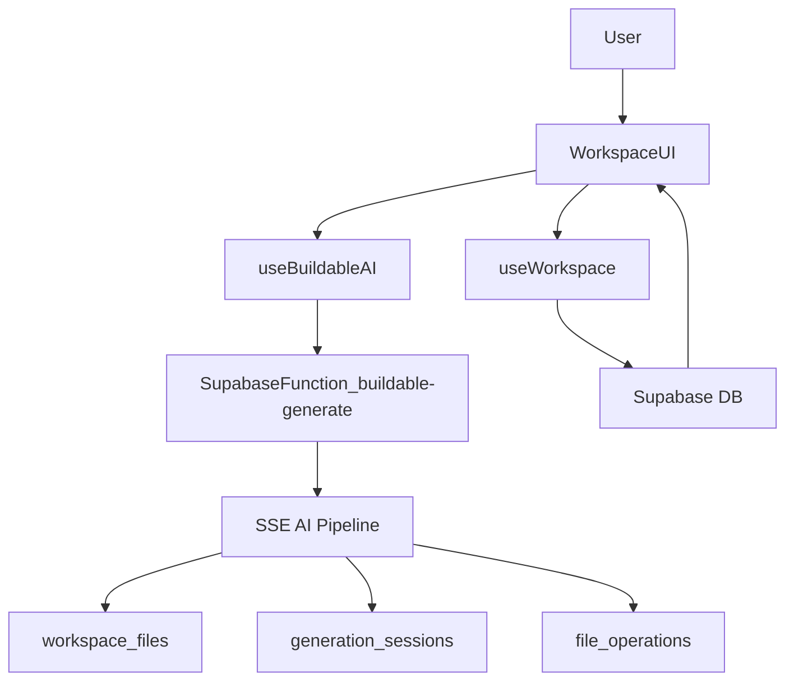

## Workspace & AI Generation Architecture

This document describes how the Buildable workspace, AI generation pipeline, and live preview fit together across the **frontend**, **Supabase Edge functions**, and the optional **Railway backend**.

---

## High-level flow

At a high level, the AI workspace works as follows:

- **User actions** happen inside `ProjectWorkspaceV3` (chat, file browsing, preview).
- **`useWorkspace`** owns workspace identity, file lists, sessions, and Realtime updates via direct Supabase queries.
- **`useBuildableAI`** streams AI generation from the `buildable-generate` Edge function via SSE and patches the in-memory file store.
- **Supabase tables** (`workspaces`, `workspace_files`, `generation_sessions`, `file_operations`) are the single source of truth for persisted state.

---

## Frontend workspace flow

**Main components & hooks**

- `src/components/workspace/ProjectWorkspaceV3.tsx`
  - Orchestrates the workspace experience (chat, file explorer, preview, version history).
  - Uses:
    - `useWorkspace(projectId)` for workspace, files, sessions, operations, and Realtime.
    - `useBuildableAI(projectId)` for AI generation and SSE progress.
    - `useProjectMessages(projectId)` for chat history stored in `project_messages`.
    - `useProjectFilesStore()` for the in-memory file tree and compiled preview HTML.
- `src/components/workspace/PipelineProgressBar.tsx`
  - Visualizes the current generation **phase** (context → intent → planning → generating → validating → complete) and file count.

**Workspace lifecycle (`useWorkspace`)**

- On mount, `useWorkspace`:
  - Calls `get_or_create_workspace` via `supabase.rpc` to ensure a `workspaces` row exists for the `(projectId, userId)` pair.
  - Fetches the workspace record from `workspaces`.
  - Loads files from `workspace_files`, sessions from `generation_sessions`, and operations from `file_operations`.
  - Subscribes to Supabase Realtime on:
    - `generation_sessions` → updates `generationStatus` / `liveSession`, invalidates queries when a session completes.
    - `workspace_files` → increments `liveFilesCount`, invalidates file queries on insert/update.
    - `file_operations` → invalidates operation history.

**AI generation via `useWorkspace.generate` (Lovable Gateway path)**

- `useWorkspace.generate(prompt)` invokes the `workspace-api` Edge function with:
  - `action: "generate"`
  - `workspaceId`
  - `{ prompt }`
- `workspace-api`:
  - Authenticates the user using the JWT passed from the client.
  - Validates credits via `user_has_credits` RPC.
  - Creates a `generation_sessions` row with `status: "planning"`.
  - Calls the Lovable AI Gateway (`LOVABLE_AI_GATEWAY`) in two phases:
    - **Architect** (planning JSON).
    - **Code** (markdown code blocks with `language:path` headers).
  - Parses file operations from the markdown and:
    - Inserts into `file_operations`.
    - Upserts code into `workspace_files` (marking `is_generated: true`).
  - Marks the session as `completed` and deducts credits via `deduct_credits` RPC.
- `useWorkspace` picks up changes via Realtime and re-fetches `workspace_files`, `generation_sessions`, and `file_operations`, then exposes them to `ProjectWorkspaceV3`.

**Chat + AI generation via `useBuildableAI` (SSE path)**

- `ProjectWorkspaceV3.handleSendMessage`:
  - Saves the user message to `project_messages`.
  - Builds a `conversationHistory` array from all messages.
  - Maps current `workspace_files` to `{ path, content }` for additional context.
  - Calls `useBuildableAI.generate(prompt, workspaceId, history, existingFiles, ...)`.

- `useBuildableAI.generate`:
  - Posts to `functions/v1/buildable-generate` (Supabase Edge function) with:
    - `projectId`, `workspaceId`, `prompt`, `conversationHistory`, `existingFiles`.
  - Handles two response modes:
    - **JSON** → legacy / Railway backend path (non-streaming).
    - **`text/event-stream` (SSE)** → primary path.
  - Parses each SSE line via `parseSSEEvent` from `src/lib/syncEngine`.
  - For `"stage"` events:
    - Maps pipeline stage → `GenerationPhase` via `STAGE_LABELS`.
    - Updates `phase` to drive `PipelineProgressBar` and status text.
  - For `"file"` events:
    - Dispatches directly to `useProjectFilesStore`:
      - `DELETE_FILE` → `removeFile`.
      - `PATCH_FILE` → `patchFile`.
      - `CREATE_FILE` / `UPDATE_FILE` → `addFile`.
    - Increments `filesDelivered` for the UI.
  - For `"complete"` events:
    - Populates `GenerationMetadata` (sessionId, modelsUsed, routes, suggestions, aiMessage, etc.).
    - Marks `phase` as `complete` and stops streaming.
  - For `"error"` events:
    - Sets `phase` to `error`, records `error`, and surfaces a toast.

- `ProjectWorkspaceV3` reacts to store/file changes:
  - On initial `workspaceFiles` load → seeds `useProjectFilesStore` and compiles a static preview HTML into `previewHtml`.
  - While `isGenerating` and `files` change → recompiles the preview using `compileWorkspaceEntryToHtml` and `generatePreviewHtml`, so the iframe reflects streamed-in changes.
  - On completion → creates a new version snapshot via `useFileVersions`, updates `preview_html` in `projects`, and appends assistant messages summarizing what changed.

---

## Supabase Edge functions

### `buildable-generate` (SSE AI pipeline)

- Entry: `supabase/functions/buildable-generate/index.ts`.
- Responsibilities:
  - Validates authentication and loads the Supabase service client.
  - Ensures a `workspaces` row exists for the `(projectId, user)` (fallback if client didn’t provide `workspaceId`).
  - Enforces per-user AI rate limits via `check_ai_rate_limit` RPC.
  - (Optionally) tries the external Railway backend at `https://api.buildablelabs.dev/api/generate/:workspaceId`:
    - If it returns JSON, the client falls back to non-streaming mode.
  - Otherwise:
    - Creates a `generation_sessions` row (`status: "pending"`).
    - Marks the workspace `status: "generating"`.
    - Calls `createPipelineContext` and `runPipeline` from `./pipeline/index.ts`, wiring an `OnSyncEvent` handler that:
      - Emits SSE `"stage"` and `"file"` events to the client.
      - Calls `saveFileToDatabase` to upsert `workspace_files` and insert `file_operations` as files stream out.
    - Calls `updateSessionStatus` to finalize the `generation_sessions` row (success/failure, metrics, telemetry).
    - Restores workspace `status` to `"ready"` or `"error"`.

### `workspace-api` (Lovable Gateway pipeline)

- Entry: `supabase/functions/workspace-api/index.ts`.
- Key actions:
  - `getOrCreateWorkspace` → mirrors the `get_or_create_workspace` RPC but via a REST-style API.
  - `getFiles`, `getSessions`, `getOperationHistory` → simple JSON endpoints around `workspace_files`, `generation_sessions`, `file_operations`.
  - `generate` → two-phase architect + code flow via Lovable AI Gateway, writing to `workspace_files` and `file_operations`, and updating `generation_sessions` + credits.
- In the current frontend:
  - `useWorkspace.generate` calls `workspace-api` for “one-shot” generation (no streaming).
  - `useBuildableAI` + `buildable-generate` is the **SSE-first** path and powers the richer in-workspace experience.

---

## Railway backend (`docs/backend-repo`)

The optional backend in `docs/backend-repo` is a Bun/Hono service that mirrors and extends the Edge pipeline:

- `src/api/generate.ts`:
  - Provides REST routes under `/api/generate/:workspaceId` for:
    - Estimating credits.
    - Starting a generation via `GenerationPipeline` (non-SSE).
    - Refinement via `RefinementPipeline`.
    - Querying/cancelling sessions.
  - Uses `creditsMiddleware` and shared DB helpers from `src/db/queries.ts`.
- `src/api/workspace.ts`:
  - Exposes `workspaceRoutes` for:
    - Creating/fetching workspaces.
    - Listing files, sessions, and operation history.
- `src/services/ai/pipeline/index.ts`:
  - Implements an 8-stage AI pipeline very similar to the Edge version, but designed for a traditional REST backend (no SSE).
- Both the backend and the Edge pipeline write to the **same Supabase tables**, so the frontend always reads a consistent workspace state regardless of where generation ran.

---

## Single source of truth & data flow guarantees

- **Authoritative store**: `workspaces`, `workspace_files`, `generation_sessions`, and `file_operations` in Supabase are the ground truth for:
  - Which files exist and whether they were AI-generated.
  - What operations were applied and by which sessions.
  - The status and metrics of each generation run.
- **Frontend state**:
  - `useWorkspace` reads from Supabase and subscribes to Realtime to stay in sync with the database.
  - `useProjectFilesStore` is an in-memory projection optimized for:
    - Fast file navigation.
    - Live preview compilation.
    - Smooth SSE-driven updates during generation.
- **AI paths**:
  - **Streaming path**: `useBuildableAI` → `buildable-generate` (SSE) → pipeline with progressive file + stage events.
  - **Non-streaming path**: `useWorkspace.generate` → `workspace-api` → Lovable AI Gateway → batch file operations.

These two paths share the same underlying workspace and file tables, which is why the UI can freely mix streamed changes with later non-streamed generations while keeping the preview and history consistent.

